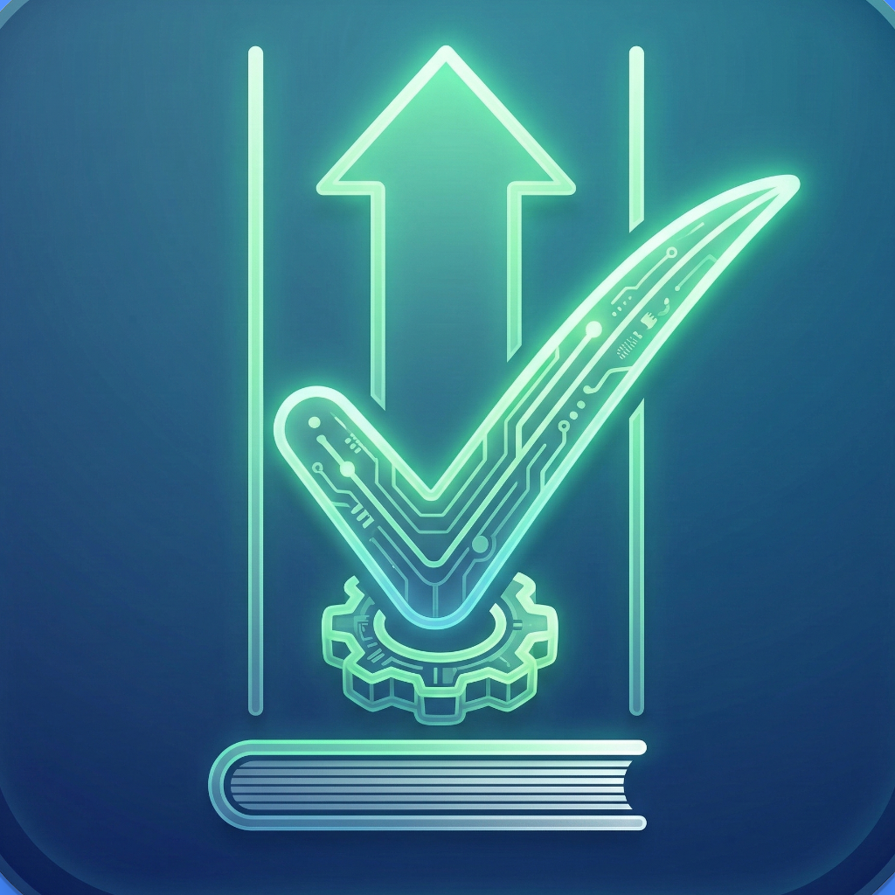

<p align="center">
  
</p>

# 📓 Dijital Defter

**Fiziksel envanter bakım defterini dijital ortama taşıyan, Flutter ile geliştirilmiş mobil uygulama.**

Saha teknik personeli bakım kayıtlarını sayfa bazlı girebilir, düzenleyebilir ve anında PDF/DOCX raporları oluşturup WhatsApp veya e-posta ile paylaşabilir. Veriler cihazda saklanır; **internet olmadan** çalışır.

---

## 📱 Ekran Görüntüleri

Uygulama ekranlarına ait görselleri `docs/screenshots/` klasörüne aşağıdaki isimlerle ekleyebilirsiniz. Ekledikten sonra aynı isimleri README içinde kullanarak bu bölümde gösterebilirsiniz.

| Görsel | Dosya adı | Açıklama |
|--------|-----------|----------|
| 1 | `01-ana-ekran.png` | Ana ekran – sayfa listesi |
| 2 | `02-sayfa-detay.png` | Sayfa detayı – kayıt tablosu |
| 3 | `03-rapor-menu.png` | Rapor Al menüsü |
| 4 | `04-ayarlar.png` | Ayarlar – tema ve kurum bilgileri |
| 5 | `05-pdf-onizleme.png` | PDF önizleme ekranı |

**Örnek kullanım (görselleri ekledikten sonra):**  
``  
şeklinde satır ekleyerek görselleri README’de gösterebilirsiniz.

---

## ✨ Özellikler

### 📄 Sayfa yapısı
- Kayıtlar **defter sayfaları** altında gruplanır.
- Ana ekranda sayfa kartları; sayfa detayında satır satır **tablo görünümü**.
- Sayfaları adlandırma, **sürükleyerek sıralama** ve silme (uzun basma veya menü).

### 📊 Veri girişi
- **Demirbaş No**, **Asansör No**, **Malzeme Adı**, **Bulunduğu Birim**, **Bakım Tarihi**, **Yapılan İşlem**, **Bakım Yapan**, **Durum** (Yapıldı / Yapılmadı).
- **"Kaydet ve yeni kayıt ekle"** ile çıkmadan ardışık kayıt.
- Tablo sütunları ve sırası özelleştirilebilir; ayarlar cihazda saklanır.

### 📑 Raporlama
- **PDF** ve **DOCX** üretimi; kurum bilgileri ve kullanıcı tanımlı rapor başlığı.
- **Türkçe karakter** desteği (Noto Sans); çok satırlı metin.
- Sayfa detayından **"Rapor Al"** menüsü:
  - PDF ile görüntüle (tam ekran, zoom/pan)
  - PDF kaydet / paylaş
  - DOCX ile görüntüle
  - DOCX kaydet / paylaş

### ⚙️ Ayarlar & Diğer
- **Kurum adı**, birim, sorumlu kişi, dönem, rapor başlığı (yerel saklama).
- **Tema:** Aydınlık / Karanlık / Sistem.
- **Neler yeni:** Uygulama özellikleri ve güncellemeler listesi.
- **Hakkında:** Uygulama adı, sürüm ve geliştiren bilgisi.
- **Yedekleme:** Veritabanı (.db) ve JSON dışa aktarma; paylaşım.
- **Hata raporu:** Hatalar cihazda saklanır; WhatsApp/e-posta ile paylaşılabilir.
- **Çevrimdışı:** Tüm veriler SQLite ile cihazda; internet gerekmez.

---

## 🛠 Teknoloji

| Kategori    | Kullanılan teknoloji |
|------------|----------------------|
| Framework  | Flutter (Android öncelikli, minSdk 21) |
| Veritabanı | SQLite (sqflite) |
| PDF        | pdf, printing |
| DOCX       | docx_creator |
| Paylaşım   | share_plus |
| Dosya      | path_provider, path |
| Ayarlar    | shared_preferences |
| Tarih      | intl |

---

## 🚀 Kurulum ve Çalıştırma

### Gereksinimler
- [Flutter SDK](https://docs.flutter.dev/get-started/install) (proje SDK: ^3.10.8)
- Android Studio / VS Code (isteğe bağlı)

### Adımlar

```bash
# Projeyi klonlayın
git clone https://github.com/tomm2492s/Dijital-Defter.git
cd Dijital-Defter

# Bağımlılıkları yükleyin
flutter pub get

# Uygulamayı çalıştırın (bağlı cihaz veya emülatör)
flutter run
```

### Uygulama ikonu (isteğe bağlı)
Logo dosyasından launcher ikonu üretmek için:

```bash
dart run flutter_launcher_icons
```

---

## 📁 Proje yapısı

```
lib/
├── main.dart                 # Uygulama girişi, tema, hata yakalama
├── theme/                    # Aydınlık ve karanlık tema
├── screens/                  # Ana ekran, sayfa detayı, form, ayarlar, rapor, PDF önizleme
├── widgets/                  # Tablo, liste öğeleri
├── models/                   # Bakım kaydı, sayfa modelleri
├── services/                 # Veritabanı, ayarlar, rapor, depolama, hata logu
└── utils/                    # Tablo sütunları, uygulama bilgisi
docs/                         # PRD, TRD, SRS, kullanıcı kılavuzu, sprint planı
assets/
├── fonts/                    # PDF Türkçe karakter (Noto Sans)
└── images/                   # Uygulama logosu (logo.png)
```

---

## 📚 Dokümanlar

| Doküman | Açıklama |
|--------|----------|
| [Kullanıcı Kılavuzu](docs/USER_GUIDE.md) | Uygulamanın kullanımı |
| [Sprint planı](docs/dijital_defter_sprints.md) | Tamamlanan işler ve plan |
| [Sürüm notları](CHANGELOG.md) | Değişiklik geçmişi |
| [Ürün Gereksinimleri (PRD)](docs/PRD.md) | Ürün tanımı ve akışlar |
| [Teknik Gereksinimler (TRD)](docs/TRD.md) | Mimari ve teknik detaylar |
| [Test planı](docs/TEST_PLAN.md) | Test senaryoları |
| [Backlog](docs/BACKLOG.md) | Gelecek geliştirmeler |

---

## 📄 Lisans

Bu proje şu an yayın için işaretlenmemiştir (`publish_to: 'none'`).

---

## 👤 Geliştiren

**Dijital Defter** v1.0 — *Serhan Şeftalioğlu*

Proje Flutter ile oluşturulmuştur. [Flutter dokümantasyonu](https://docs.flutter.dev/).
