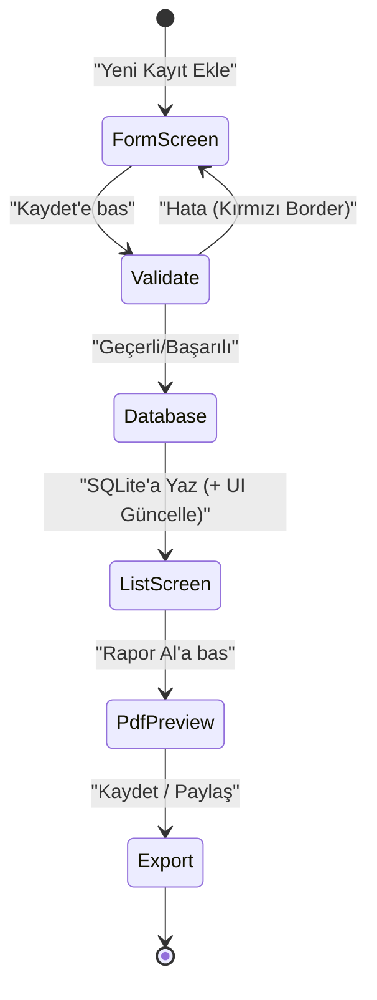

# Ürün Gereksinimleri Dokümanı (PRD): Dijital Defter

Bu doküman, iş hedeflerini, kullanıcı hikayelerini ve teknik detayları tek çatı altında toplayarak geliştirme sürecinin ana rehberi olarak kullanılır.

**Ürün:** Dijital Defter v1.0 | **Durum:** Taslak / Onay Bekliyor | **Ürün Sahibi:** Serhan Şeftalioğlu  

**Platform Planı:** Şimdilik **Android**; daha sonra **iOS** (Flutter ile tek kod tabanı).

---

## 1. Ürün Özeti (Product Vision)

Dijital Defter, teknik personelin saha operasyonlarında kullandığı fiziksel "Envanter Bakım Defteri"ni dijital ortama taşıyan bir mobil uygulamadır. Karmaşık yazılımlar yerine, görseldeki tablo yapısına sadık kalarak hızlı veri girişi ve anında profesyonel rapor (PDF/DOCX) üretimine odaklanır.

## 2. Hedef Kitle (Target Audience)

- **Birincil:** Saha teknik personeli (asansör bakımcıları, bina teknik işler görevlileri)
- **İkincil:** Birim yöneticileri ve denetmenler (raporları inceleyen ve onaylayanlar)

## 3. Kullanıcı Hikayeleri (User Stories)

| ID    | Rol        | İstek                                           | Amaç                               |
|-------|------------|-------------------------------------------------|------------------------------------|
| US-01 | Teknisyen  | Bakım bilgilerini telefonumdan girmek istiyorum | Fiziksel defter taşımamak için     |
| US-02 | Teknisyen  | "Durum" sütununu tek tıkla işaretlemek istiyorum | Zaman kazanmak, hata azaltmak      |
| US-03 | Yönetici   | Bakım sonuçlarını profesyonel tablo olarak almak | Resmi kayıt ve denetimlere uygun  |
| US-04 | Teknisyen  | İnternet yokken bile kayıt girmek istiyorum      | Bodrum/asansör boşluğunda çalışmak |
| US-05 | Teknisyen / Yönetici | Başka bir teknisyenin verilerini uygulamama alıp kendi verilerimle birleştirmek istiyorum | Ekipler arası ortak rapor sunabilmek için |

## 4. Fonksiyonel Gereksinimler

### 4.1. Veri Giriş Modülü

- **[FR-01]** Demirbaş No, Asansör No, Malzeme Adı, Bulunduğu Birim, Bakım Tarihi, Yapılan İşlem, Bakım Yapan alanları doldurulabilmeli
- **[FR-02]** "Durum" alanı "Yapıldı" (✅) / "Yapılmadı" (❌) seçim aracına sahip olmalı
- **[FR-03]** "Bakım Tarihi" varsayılan günün tarihi; değiştirilebilir olmalı

### 4.2. Çıktı ve Raporlama

- **[FR-04]** Veriler kurum bilgileriyle orijinal defter formatında PDF’e dökülmeli
- **[FR-05]** Veriler düzenlenebilir tablo yapısında Word (DOCX) olarak aktarılmalı
- **[FR-06]** Oluşturulan dosya WhatsApp, E-posta ve yerel depolama ile paylaşılabilmeli
- **[FR-07]** Rapor başlığı ayarlardan kullanıcı tarafından belirlenebilmeli
- **[FR-08]** PDF/DOCX için ayrı ayrı “görüntüle” ve “kaydet/paylaş” seçenekleri sunulmalı
- **[FR-09]** PDF önizleme tam ekranda; kullanıcı yakınlaştırıp uzaklaştırabilmeli (zoom/pan)

### 4.3. Kabul Kriterleri (Acceptance Criteria)

- FR-01: Zorunlu alanlar doldurulmadan kayıt yapılamaz; kayıt sonrası liste güncellenir
- FR-02: Durum değişince görsel (✅/❌) anında güncellenir
- FR-03: Tarih seçicide varsayılan bugün; değiştirilebilir
- FR-04: PDF kurum bilgileri ve tablo formatında üretilir; paylaşılabilir
- FR-05: DOCX düzenlenebilir tablo olarak açılır
- FR-06: Paylaşım menüsünde WhatsApp, E-posta ve "Kaydet" sunulur

### 4.4. Öncelik Matrisi (MoSCoW)

- **Must:** FR-01, FR-02, FR-03, FR-04, FR-06
- **Should:** FR-05 (DOCX)
- **Could:** Gelişmiş filtreler, toplu export
- **Won’t (v1):** Bulut senkronizasyonu, çoklu dil, fotoğraf ekleme

### 4.5. Bağımlılıklar

- PDF/DOCX için Kurum Adı, Birim, Sorumlu ve Dönem (ayarlardan) zorunlu
- Paylaşım için cihazda Share/Intent desteği gerekir

## 5. Tasarım ve Kullanıcı Deneyimi (UX/UI)

- **Sadelik:** Form odaklı; gereksiz menülerden kaçınılmalı
- **Görsel geri bildirim:** Yapıldı/Yapılmadı Yeşil/Kırmızı vurgulanmalı
- **Sayfa yapısı:** Ana ekranda defter sayfaları kartları; sayfa detayında satır satır tablo görünümü (fiziksel defter metaforu)
- **Sayfa yönetimi:** Sayfalar adlandırılabilir, sürükleyerek sıralanabilir ve silinebilir; menü karta uzun basarak veya üç nokta ile açılır
- **Tablo görünümü:** Sayfa bazlı sütun seçimi ve sırası kullanıcı tarafından düzenlenebilir; bu ayarlar veritabanında saklanır (uygulama kapatılıp açılsa da korunur)
- **Rapor önizleme:** PDF tam ekranda; açılışta sayfa ortada ve ekrana sığacak şekilde, beyaz arka plan; parmakla zoom ve pan ile rahat inceleme
- **Arayüz Tel Kafesleri (Wireframes):** Geliştirme aşamasında her ana ekran (Dashboard, Form, Rapor Önizleme) için düşük çözünürlüklü dijital tasarımlar (Figma) baz alınacaktır. Kaba taslak olarak:
  - Ekran 1 (Dashboard): Üstte Arama çubuğu, ortada defter sayfası kartları, sağ altta Floating Action Button (Yeni Sayfa/Kayıt).
  - Ekran 2 (Form): Yukarıdan aşağıya kaydırılabilir Material Text/Dropdown alanları, en altta tam genişlikte "Kaydet" butonu.

### 5.1. Telemetri ve Analitik Planı (Gelecek Vizyonu)
Mevcut v1 sürümünde %100 çevrimdışı ve anonim çalışılmaktadır. Ancak gelecekte ölçümleme (Firebase Analytics vb.) eklendiğinde aşağıdaki davranışlar (Kişisel veri içermeden) toplanacaktır:
- `record_created`: Form kayıt başarı metrikleri
- `pdf_exported` / `docx_exported`: En çok kullanılan çıktı türü
- `data_merged`: Senkronizasyon (İçe/Dışa aktarım) kullanım sıklığı

### 5.1. Durum Akış Diyagramı (State & Flow Diagram)

## 6. Teknik Kısıtlamalar ve Gereksinimler

- **Platform:** Flutter (Cross-platform). İlk hedef Android; iOS roadmap’te sonraki aşamada
- **Veri saklama:** On-device SQLite
- **Güvenlik:** Veriler yerelde; "Veritabanını Yedekle" seçeneği sunulmalı

## 7. Başarı Metrikleri (Analytics & KPIs)

- **Raporlama süresi:** Bir bakım formunun PDF olarak paylaşılması 60 saniyeden az
- **Doğruluk:** Raporlardaki eksik alan oranı %0 (zorunlu alan kontrolü ile)
