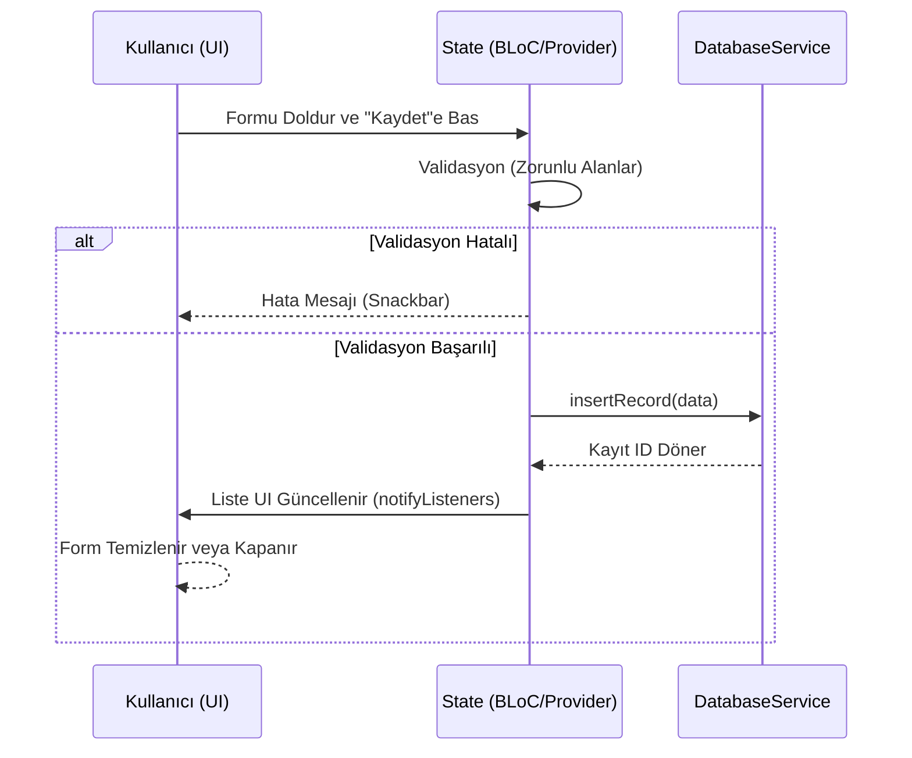

# Teknik Gereksinimler Dokümanı (TRD): Dijital Defter

Bu doküman, projenin "nasıl" inşa edileceğine dair yol haritası ve geliştirici için teknik rehber niteliğindedir.

**Proje:** Dijital Defter v1.0  
**Teknoloji yığını:** Flutter & SQLite  

**Platform stratejisi:** Önce **Android** geliştirilip yayımlanacak; **iOS** aynı Flutter kod tabanı ile sonraki aşamada hedeflenecektir. MVP önce Android’de test edilir, ardından iOS dağıtımı planlanır.

---

## 1. Sistem Mimarisi (System Architecture)

Uygulama **Layered (Katmanlı) Mimari** kullanacaktır. Veritabanı işlemleri ile arayüz mantığı birbirinden ayrılacaktır.

- **Presentation Layer (Sunum):** Flutter widget’ları ve State Management (Provider/BLoC)
- **Domain Layer (İş mantığı):** Veri modelleri ve validasyon kuralları
- **Data Layer (Veri):** SQLite (Sqflite) Database Helper ve dosya sistemi erişimi

## 2. Teknoloji Yığını ve Bağımlılıklar (Tech Stack)

| Kategori     | Paket Adı      | Amaç                                      |
|-------------|----------------|-------------------------------------------|
| Framework   | Flutter        | Cross-platform mobil uygulama             |
| Veritabanı  | sqflite        | Yerel veri depolama                       |
| Dosya yolu  | path_provider  | PDF ve DB dosyalarının klasör erişimi     |
| PDF üretim  | pdf & printing | Tablo yapısında PDF oluşturma             |
| Paylaşım    | share_plus     | Raporun paylaşılması                      |
| DOCX açma   | open_filex    | DOCX’i harici uygulamada görüntüleme      |
| Tarih       | intl           | Tarih ve saat formatlanması               |

## 3. Veritabanı Şeması ve Veri Modeli

```mermaid
erDiagram
    sheet_pages ||--o{ maintenance_records : "has many"
    sheet_pages ||--o| page_view_config : "has one"
    sheet_pages {
        INTEGER id PK
        TEXT title
        TEXT created_at
        INTEGER sort_order
    }
    page_view_config {
        INTEGER page_id PK_FK
        TEXT column_ids
    }
    maintenance_records {
        INTEGER id PK
        INTEGER page_id FK
        TEXT inventory_no
        TEXT elevator_no
        TEXT material_name
        TEXT unit_location
        TEXT maintenance_date
        TEXT action_done
        TEXT technician
        INTEGER status
    }
```

### 3.1. sheet_pages Tablosu

Defter sayfaları; kayıtlar sayfa bazlı gruplanır.

| Kolon Adı  | Veri Tipi | Kısıtlamalar              |
|------------|-----------|---------------------------|
| id         | INTEGER   | PRIMARY KEY, AUTOINCREMENT|
| title      | TEXT      | NULLABLE                  |
| created_at | TEXT      | ISO8601 String            |
| sort_order | INTEGER   | NOT NULL DEFAULT 0 (sıralama) |

### 3.2. page_view_config Tablosu

Sayfa bazlı tablo görünümü ayarları (hangi sütunlar, sırası); uygulama kapatılıp açılsa da kalır.

| Kolon Adı   | Veri Tipi | Kısıtlamalar              |
|-------------|-----------|---------------------------|
| page_id     | INTEGER   | PRIMARY KEY (FK sheet_pages) |
| column_ids  | TEXT      | JSON array (sütun id listesi) |

### 3.3. maintenance_records Tablosu

Ana veri bu tabloda tutulacaktır.

| Kolon Adı        | Veri Tipi | Kısıtlamalar              |
|------------------|-----------|---------------------------|
| id               | INTEGER   | PRIMARY KEY, AUTOINCREMENT|
| page_id          | INTEGER   | NULLABLE (FK sheet_pages) |
| inventory_no     | TEXT      | NULLABLE                  |
| elevator_no      | TEXT      | NOT NULL                 |
| material_name    | TEXT      | NOT NULL                 |
| unit_location    | TEXT      | NOT NULL                 |
| maintenance_date | TEXT      | ISO8601 String           |
| action_done      | TEXT      | NOT NULL                 |
| technician       | TEXT      | NOT NULL                 |
| status           | INTEGER   | 0 (Yapılmadı) veya 1 (Yapıldı) |

### 3.4. Veritabanı Göç (Migration) Stratejisi
- Yeni bir tablo veya kolon (örn. resim yolu veya imza verisi) eklendiğinde `sqflite` `onUpgrade` metodu tetiklenir.
- Versiyon numarası artırılarak `ALTER TABLE maintenance_records ADD COLUMN new_column TEXT;` gibi DDL komutları çalıştırılır.
- Mevcut veriler (kullanıcı kayıtları) bu işlem sırasında kaybolmaz. Veri bütünlüğünü sağlamak için transaction blokları kullanılır.

## 4. Teknik İşlevler (Technical Features)

### 4.1. PDF Render Motoru

- **Header:** pw.Header ile kullanıcı tanımlı rapor başlığı (ayarlardan) ve kurum bilgileri
- **Font:** Noto Sans (assets/fonts veya PdfGoogleFonts) ile Türkçe karakter desteği
- **Tablo:** Veritabanından liste `List<TableRow>` yapısına dönüştürülür; çok satırlı hücreler satır sonu ile bölünür
- **Durum:** status 1 → "Yapıldı", 0 → "Yapılmadı" metin olarak

### 4.2. PDF Önizleme

- Tam ekran `PdfPreviewScreen`; açılışta sayfa layout ile ortada ve ekrana sığacak şekilde (Center + FittedBox), beyaz arka plan
- `PdfPreview.builder` ile `scrollViewDecoration` ve `pdfPreviewPageDecoration` (BoxDecoration color: beyaz) kullanılarak önizleme alanında gri arka plan engellenir
- `InteractiveViewer` ile yakınlaştırma/uzaklaştırma (0.5x–4x) ve pan; çok sayfalı PDF'de altta önceki/sonraki sayfa geçişi
- AppBar’da "Kaydet / Paylaş" ile aynı PDF paylaşılabilir

### 4.3. Hata Loglama ve Raporlama

- **ErrorLogService** (singleton): Tüm hatalar cihaz hafızasında saklanır
- **Konum:** `Documents/DijitalDefter/HataKayitlari/error_log.json` (JSON array; son 500 kayıt)
- **Kayıt alanları:** zaman (UTC ISO8601), mesaj, hata türü, stack trace, bağlam (context)
- **Paylaşım:** Ayarlar > Hata kayıtları > "Hata raporunu paylaş" ile tüm kayıtlar okunabilir `.txt` dosyasına dönüştürülür ve `share_plus` ile WhatsApp/e-posta vb. paylaşılabilir
- **Global yakalama:** `main.dart` içinde `FlutterError.onError` ve `runZonedGuarded` ile yakalanmamış hatalar da loglanır; ekranlardaki try-catch bloklarında yakalanan hatalar bağlam bilgisi ile loglanır

### 4.4. Yerel Depolama Stratejisi

- Veritabanı dosyası `databases` klasöründe
- PDF çıktıları geçici (Temporary) veya belgeler (Documents) klasöründe; paylaşım sonrası isteğe bağlı silinebilir
- Hata logları `Documents/DijitalDefter/HataKayitlari/` altında; paylaşım için üretilen rapor dosyaları aynı klasörde

### 4.5. State Management Akış Mekanizması

Arayüz (UI) ve Veritabanı etkileşimi için state management (Örn: Provider) kullanılacaktır:



### 4.6. Veri Senkronizasyonu (Sync / Merge) Teknik Altyapısı
Çoklu kullanıcılı offline senkronizasyon için `.json` formatında Export desteklenecektir.
- **Dışa Aktarma:** Seçilen sayfalar veya tüm DB, JSON array olarak string'e çevrilir ve fiziksel dosyaya yazılır.
- **İçe Aktarma (Conflict Resolution):** Gelen JSON Parse edilir. `maintenance_records`'daki kayıtların çakışmaması için `(asansor_no + bakim_tarihi + malzeme_adi)` alanları unique hash olarak değerlendirilir. Aynı gün aynı asansörün aynı parçasına yapılmış kayıt varsa "Merge overwrite" yapılmaz (duplicate engellenir). Yoksa yeni kayıt olarak ID bağımsız veritabanına `INSERT` edilir.

### 4.7. Güvenlik Detayları
- **Backup Güvenliği:** Cihazdaki SQLite `.db` dosyası, uygulamanın kendi app-data dizinindedir (Root yetkisi olmadan dışarıdan erişilemez). Uygulama `AndroidManifest.xml` dosyasında `android:allowBackup="true"` yapılandırılırsa, Google Drive otomatik yedeğine dahil olur; güvenlik veya KVKK gereği istenmezse "false" yapılır.

## 5. Performans ve Güvenlik Parametreleri

- **Veri bütünlüğü:** Her transaction sonrası commit doğrulanır; close öncesi
- **Hız:** Liste yüklemeleri FutureBuilder veya StreamBuilder ile asenkron
- **Hata yönetimi:** try-catch; kullanıcıya anlamlı hata mesajları (Snackbar); tüm hatalar ErrorLogService ile cihaza kaydedilir ve paylaşılabilir rapor üretilir

## 6. Kodlama Standartları

- **Naming:** Değişkenler camelCase, sınıflar PascalCase, veritabanı kolonları snake_case
- **Modülerlik:** Veritabanı işlemleri `DatabaseService` singleton sınıfında toplanacak

## 7. Proje Klasör / Modül Yapısı (Flutter)

- **lib/:** `main.dart`; `screens/` (Dashboard, PageDetail, RecordForm, Settings, Report, PdfPreviewScreen); `widgets/` (RecordTableSheet vb.); `models/` (MaintenanceRecord, SheetPage); `services/` (DatabaseService, ErrorLogService, ReportService, SettingsService, StorageService); `utils/`
- **assets/fonts/:** Noto Sans (PDF Türkçe karakter) – opsiyonel; yoksa PdfGoogleFonts kullanılır
- **assets/images/:** Uygulama logosu (logo.png); Dashboard AppBar’da gösterilir. Launcher ikonu için flutter_launcher_icons kullanılır (pubspec.yaml’da image_path: assets/images/logo.png); komut: dart run flutter_launcher_icons
- **test/:** Unit testler (DB, PDF mantığı), widget testleri; manuel senaryolar dokümanda listelenir

## 8. Minimum Android Sürümü

- **minSdkVersion:** 21 (Android 5.0) — sqflite ve path_provider uyumluluğu için. Gerekirse 24’e çıkılabilir.

## 9. Test Stratejisi

- **Birim test:** Veritabanı CRUD, PDF oluşturma mantığı (mock veri ile)
- **Widget test:** Form alanları, liste, buton davranışları
- **Manuel test:** Kayıt ekleme/düzenleme/silme, filtreleme, PDF/DOCX üretimi, paylaşım, yedekleme akışları
